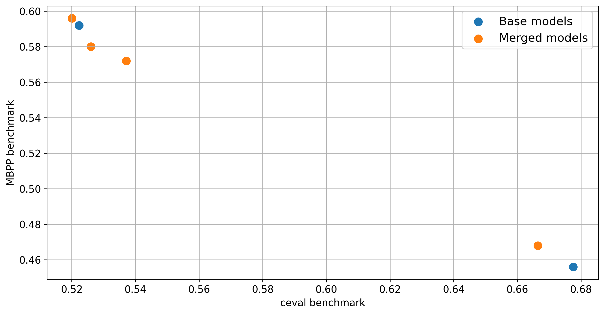

# Merging example

## Intro

This is a simple demo of merging two Qwen2.5 models:

* https://huggingface.co/Qwen/Qwen2.5-1.5B

* https://huggingface.co/Qwen/Qwen2.5-Coder-1.5B

By employing merging technique we obtain the models with code & general capabilities
in between the source models.


## Environment setup

1. Install requirements:
```bash
pip install -r requirements
```

2. Download the models `Qwen/Qwen2.5-1.5B` and `Qwen/Qwen2.5-Coder-1.5B` from HuggingFace

3. Edit state dicts paths in `configs/configs.json` to contain the location of model weights on
   our machine

## Running example

Run:
```bash
python3 merge_example.py
```

The script should produce the following result reporting the scores of merged
models on two benchmarks - `ceval` and `mbpp`.

```
| model          |   mbpp |    ceval |
|----------------|--------|----------|
| ./out/merge_01 |  0.572 | 0.537147 |
| ./out/merge_02 |  0.58  | 0.526003 |
| ./out/merge_03 |  0.596 | 0.520059 |
| ./out/merge_04 |  0.468 | 0.666419 |
```

Model merging allows us to interpolate between capabilities of the modes.

In our case we have two base models:
* `Qwen/Qwen2.5-1.5B` - better and general capabilities (e.g. measured by `ceval` benchmark),
   worse at coding (e.g. measured by `mbpp` benchmark)
* `Qwen2.5-Coder-1.5B` - worse ad general capabilities, better at coding

Model merging allows us to interpolate between the capabilities.

The benchmark results for merged models are compared with baseline models in the figure below:


