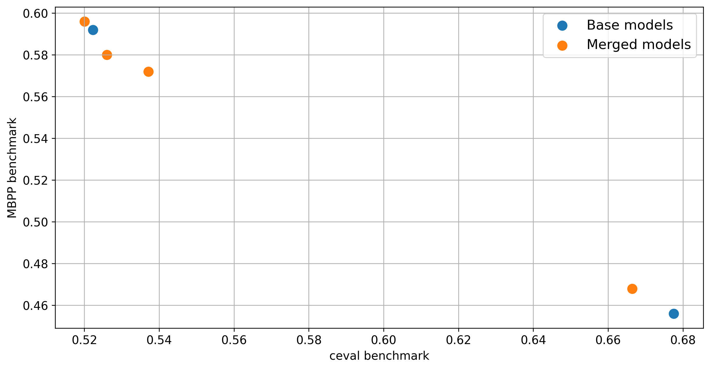

# Merging example

## Intro

This is a simple demo of merging two Qwen2.5 models:

* https://huggingface.co/Qwen/Qwen2.5-1.5B

* https://huggingface.co/Qwen/Qwen2.5-Coder-1.5B

By employing merging technique we obtain the models with code & general capabilities
in between the source models.


## Environment setup

1. Install requirements:
```bash
pip install -r requirements
```

2. Be sure to have downloaded the models `Qwen/Qwen2.5-1.5B` and `Qwen/Qwen2.5-Coder-1.5B`

3. Edit state dicts paths in `configs/configs.json` to contain the location of model weights on
   our machine

## Running example
Run:
```bash
python3
```

## Results


